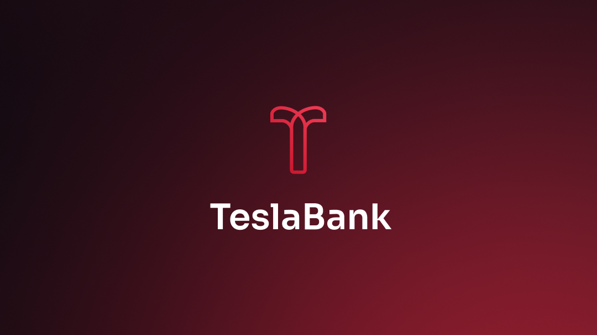

# TeslaBank

## :bank: **Projeto**



> Abrir uma conta digital nunca foi tão simples!

Esta é a Landing Page da TeslaBank, um banco fictício 100% digital. O design e identidade visual foi idealizado pelo [Iuri Silva](https://www.instagram.com/iuricode/) e conta com algumas implementações minhas, como o responsivo, menu mobile, entre outros.

<p align="center">
   <a href="https://tesla-bank.vercel.app">Veja o projeto completo aqui.</a>
</p>

## :art: **Visual do Projeto**

<!-- ### _Desktop e Telas Maiores_

<h1 align="center">
    
</h1>

### _Mobile e Telas Menores_

<h1 align="center">
    
</h1> -->

## :wrench: **Tecnologias**

Tecnologias utilizadas no projeto.

### :hammer: **Construção do site**

- [HTML](https://developer.mozilla.org/pt-BR/docs/Web/HTML)
- [JavaScript](https://developer.mozilla.org/pt-BR/docs/Web/JavaScript)
- [Vue.js](https://vuejs.org)
- [Node e NPM](https://nodejs.org/)
- [Vite](https://vitejs.dev/)

### :art: **Estilização**

- [CSS](https://developer.mozilla.org/pt-BR/docs/Web/CSS)
- [Sass (SCSS)](https://sass-lang.com)
- [Tailwind CSS](https://tailwindcss.com)
- [Heroicons](https://heroicons.com)
- [Google Fonts](https://fonts.google.com)

### :open_file_folder: **IDE, Versionamento e Deploy**

- [Figma](https://www.figma.com)
- [Visual Studio Code](https://code.visualstudio.com)
- [Git](https://git-scm.com)
- [GitHub](https://github.com)
- [Vercel](https://vercel.com/)

## :rocket: **Configurações e Instalação**

Veja [documentação de configuração do Vite](https://vitejs.dev/config/) e a instalação do [Volar](https://marketplace.visualstudio.com/items?itemName=Vue.volar).

### **Clonando o Projeto**

```sh
git clone https://github.com/davsilvam/tesla-bank
```

### **Executando o Projeto**

```sh
npm install
```

### **Compilar e abrir o programa para desenvolvimento**

```sh
npm run dev
```

### **Compilar e reduzir para produção**

```sh
npm run build
```

## :balance_scale: **Licença**

Esse projeto está sob a [licença MIT](https://github.com/davsilvam/tesla-bank/blob/main/LICENSE.md).

<p align="center">
  Feito com :coffee: por <a href="https://www.instagram.com/iuricode/">Iuri Silva</a> e com :blue_heart: por <a href="https://www.linkedin.com/in/davsilvam/">David Silva</a>.
</p>

---
